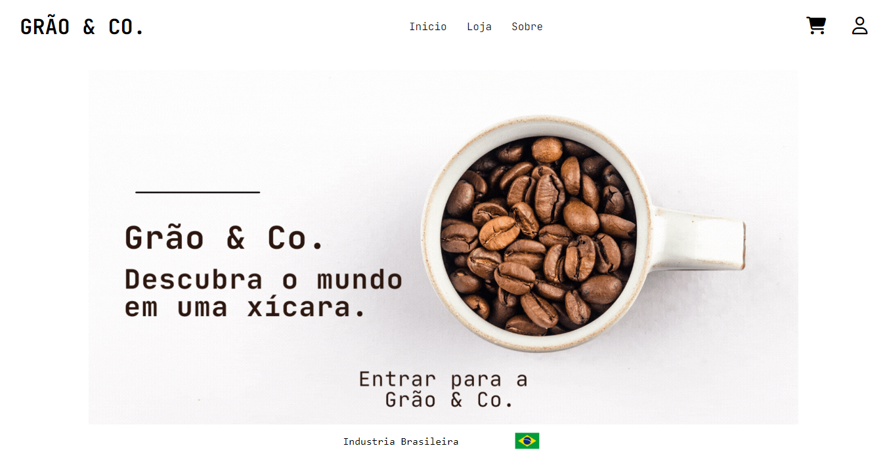

# Grão & Co.

<h2>E-commerce de venda de cafés especiais diretamente da fábrica para o cliente final</h2>

Projeto Saas, com o objetivo de facilitar a venda de produtos de uma empresa oferecendo assinaturas mensais/anuais para os clientes receberem

os produtos em sua casa todo mês!!

## Na Grão & Co., cada grão é uma história, cada história é uma experiência. Descubra o mundo em uma xícara.

>Status do projeto : Em andamento

## Funcionalidades

## Tecnologias

### Front-end

- <h3>Javascript + HTML5 + CSS3</h3>

### Back-end

- <h3>PHP</h3>

### Banco de dados

- <h3>MySql Community</h3>

# Executar

### Requisitos

- Em breve tutorial
